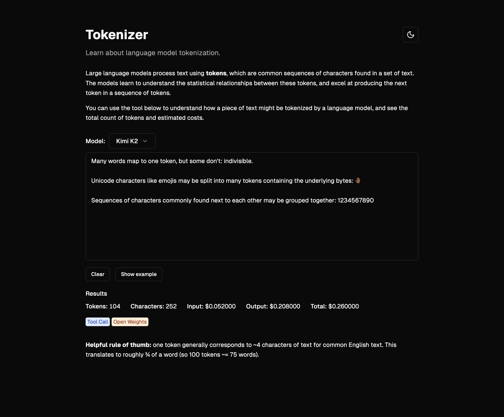

<a href="https://oss-tokenizer.vercel.app">

  <h1 align="center">Tokenizer</h1>
</a>

<p align="center">
  AI Model Tokenization with Real-time Token Counting
</p>

<p align="center">
  <a href="#features"><strong>Features</strong></a> ·
  <a href="#deploy-your-own"><strong>Deploy your own</strong></a> ·
  <a href="#running-locally"><strong>Running locally</strong></a>
</p>
<br/>

## Features

- [Next.js](https://nextjs.org)
  - App Router with file-based routing and server components
  - Built-in API routes for token counting
- [Shadcn/ui](https://ui.shadcn.com)
  - Beautiful, accessible UI components built with Radix UI
  - Custom components for consistent design and developer experience
- [Multiple AI Models](https://models.dev/?search=groq)
  - Support for various language models from SST's Models.dev database
  - Comprehensive model specifications, pricing, and capabilities data

## Deploy your own

You can deploy your own version of Tokenizer to Vercel with one click:

[](https://vercel.com/new/clone?repository-url=https%3A%2F%2Fgithub.com%2Fmuradpm%2Ftokenizer&demo-title=Tokenizer&demo-description=Learn%20about%20AI%20model%20tokenization%20with%20real-time%20token%20counting%20built%20with%20Next.js%2014.&demo-url=https%3A%2F%2Ftokenizer.vercel.app)

## Running locally

You will need to use the environment variables [defined in `.env.example`](.env.example) to run Tokenizer. It's recommended you use [Vercel Environment Variables](https://vercel.com/docs/projects/environment-variables) for this, but a `.env` file is all that is necessary.

> Note: You should not commit your `.env` file or it will expose secrets that will allow others to control access to your various accounts.

1. Clone the repository: `git clone https://github.com/muradpm/tokenizer.git`
2. Install Vercel CLI: `bun i -g vercel`
3. Link local instance with Vercel and GitHub accounts (creates `.vercel` directory): `vercel link`
4. Download your environment variables: `vercel env pull`

```bash
bun install
bun dev
```

Your app should now be running on [localhost:3000](http://localhost:3000/)
